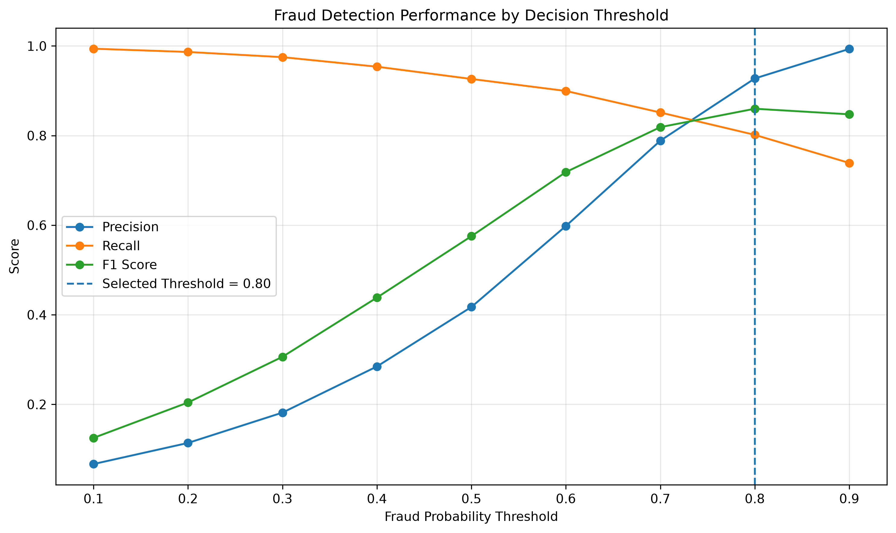
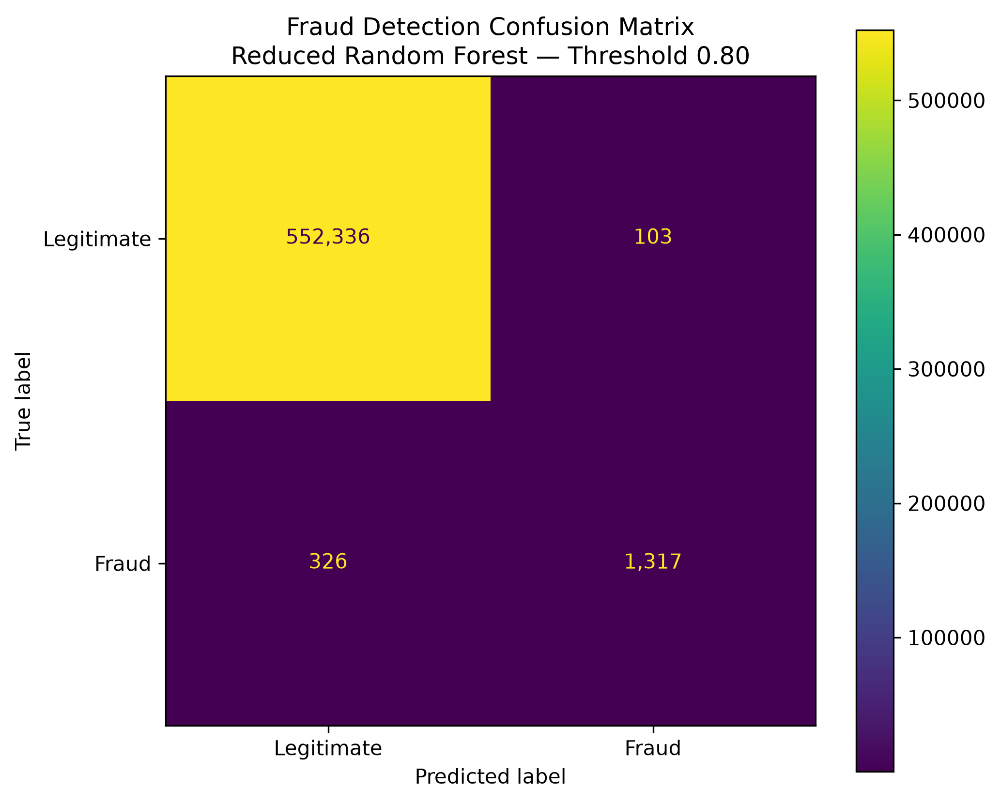
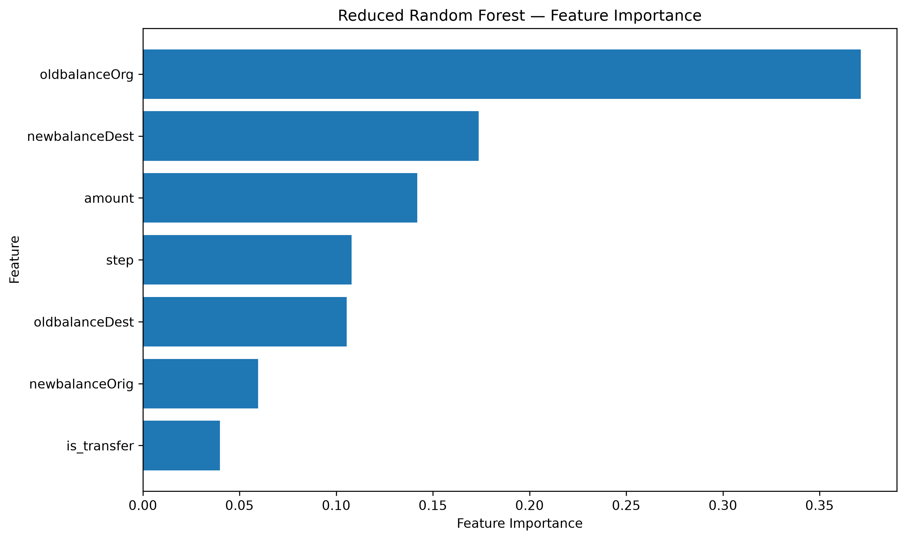

# Banking Fraud Analytics & Detection

An end-to-end fraud analytics and machine learning project using **Python, Pandas, scikit-learn, feature engineering, Random Forest modelling, model ablation, and decision-threshold optimisation**.

The project analyses more than **6.3 million synthetic financial transactions** from the PaySim dataset and develops a fraud-detection workflow focused on the real challenges of **class imbalance, false positives, missed fraud, feature leakage risk, and operational threshold selection**.

---

## Project Objective

The aim of this project was to answer several practical fraud-analytics questions:

- How rare is fraud in the dataset?
- Which transaction types contain fraudulent activity?
- Do fraudulent transactions differ in value from legitimate transactions?
- Do account-balance behaviours provide useful fraud signals?
- How effective is the existing `isFlaggedFraud` rule?
- How does a simple baseline compare with Logistic Regression and Random Forest?
- How much of the model performance depends on engineered balance features?
- What probability threshold provides a useful precision-recall trade-off?

---

## Dataset

The project uses the **PaySim Synthetic Financial Dataset for Fraud Detection**.

### Dataset size

- **6,362,620 total transactions**
- **8,213 fraudulent transactions**
- Fraud rate: **0.1291%**

This extreme imbalance means that raw accuracy is not a meaningful primary metric.

A model predicting every transaction as legitimate would achieve approximately **99.87% accuracy** while detecting **zero fraud cases**.

### Transaction types

| Transaction Type | Transactions |
|---|---:|
| CASH_OUT | 2,237,500 |
| PAYMENT | 2,151,495 |
| CASH_IN | 1,399,284 |
| TRANSFER | 532,909 |
| DEBIT | 41,432 |

Fraud occurs only in:

- `TRANSFER`
- `CASH_OUT`

---

## Exploratory Fraud Analysis

### Fraud by transaction type

| Type | Total Transactions | Fraud Transactions | Fraud Rate |
|---|---:|---:|---:|
| CASH_OUT | 2,237,500 | 4,116 | 0.1840% |
| TRANSFER | 532,909 | 4,097 | 0.7688% |
| CASH_IN | 1,399,284 | 0 | 0% |
| DEBIT | 41,432 | 0 | 0% |
| PAYMENT | 2,151,495 | 0 | 0% |

All **8,213 fraud cases** occur within `TRANSFER` and `CASH_OUT`.

`TRANSFER` transactions have the highest fraud rate at approximately **0.77%**.

---

## Transaction Amount Analysis

Fraudulent transactions were substantially larger overall.

| Transaction Class | Mean Amount | Median Amount |
|---|---:|---:|
| Legitimate | ~178,197 | ~74,685 |
| Fraudulent | ~1,467,967 | ~441,423 |

However, the relationship depends on transaction type.

For `CASH_OUT`, fraudulent transactions are clearly larger.

For `TRANSFER`, the fraudulent mean is higher, but the fraudulent median is slightly lower than the legitimate median. This shows that transaction amount alone is not sufficient for fraud detection.

---

## Balance Behaviour & Feature Engineering

The project investigated how origin and destination balances behave around transactions.

Engineered features included:

- `orig_balance_error`
- `dest_balance_error`
- `origin_emptied`
- `amount_equals_oldbalance`
- `amount_to_balance_ratio`
- `is_transfer`

A particularly strong pattern appeared around balance consistency.

### Origin balance behaviour

Fraudulent transactions were far more likely to have near-zero origin balance error.

Within fraud-relevant transaction types:

- Legitimate `CASH_OUT` transactions with origin balance error: **89.16%**
- Fraudulent `CASH_OUT`: **0.58%**
- Legitimate `TRANSFER`: **96.21%**
- Fraudulent `TRANSFER`: **0.51%**

### Destination balance behaviour

Fraudulent `TRANSFER` transactions showed extremely strong destination-balance inconsistency:

- Legitimate `TRANSFER` destination error rate: **22.07%**
- Fraudulent `TRANSFER` destination error rate: **99.95%**

These results were treated carefully because PaySim is synthetic and some patterns may reflect simulator mechanics rather than universally transferable real-world fraud behaviour.

---

## Existing Fraud Flag Rule

The dataset includes `isFlaggedFraud`, representing an existing rule-based fraud flag.

Results:

- Total fraud cases: **8,213**
- Fraud cases flagged: **16**
- Fraud cases missed: **8,197**
- Approximate recall: **0.195%**

The rule generated no false positives in this dataset, but its recall was extremely low.

This provided the motivation for building a machine-learning fraud detector.

---

## Modelling Dataset

Because all fraud occurs within `TRANSFER` and `CASH_OUT`, modelling was scoped to these transaction types.

This reduced the dataset from:

**6,362,620 → 2,770,409 transactions**

while retaining all **8,213 fraud cases**.

Fraud rate in the modelling dataset:

**0.2965%**

---

## Train / Test Split

A stratified split was used to preserve fraud prevalence.

### Training set

- 2,216,327 transactions
- 6,570 fraud cases
- Fraud rate: ~0.2964%

### Test set

- 554,082 transactions
- 1,643 fraud cases
- Fraud rate: ~0.2965%

---

## Baseline Model

A deliberately naive baseline predicted every transaction as legitimate.

Results:

- Accuracy: **99.70%**
- Precision: **0**
- Recall: **0**
- F1: **0**
- Fraud detected: **0 / 1,643**

This demonstrates why accuracy is misleading for highly imbalanced fraud problems.

---

## Logistic Regression

Logistic Regression was trained with:

- Standard scaling
- `class_weight="balanced"`

### Results

| Metric | Score |
|---|---:|
| Accuracy | 96.89% |
| Precision | 8.37% |
| Recall | 95.37% |
| F1 | 15.38% |
| ROC-AUC | 90.30% |
| PR-AUC | 56.87% |

### Confusion Matrix

- True negatives: 535,275
- False positives: 17,164
- False negatives: 76
- True positives: 1,567

The model achieved high recall but produced too many false positives.

---

## Full Random Forest

The full Random Forest used both original and engineered features.

### Results

| Metric | Score |
|---|---:|
| Precision | 100.00% |
| Recall | 99.63% |
| F1 | 99.82% |
| ROC-AUC | 99.89% |
| PR-AUC | 99.80% |

### Confusion Matrix

- True negatives: 552,439
- False positives: 0
- False negatives: 6
- True positives: 1,637

The performance was unusually strong.

Feature importance showed that engineered variables such as:

- `orig_balance_error`
- `amount_to_balance_ratio`

were highly influential.

Because PaySim is synthetic, an ablation test was performed to evaluate how dependent the performance was on these engineered signals.

---

## Feature Ablation Test

The following engineered features were removed:

- `orig_balance_error`
- `dest_balance_error`
- `amount_to_balance_ratio`
- `origin_emptied`

A reduced Random Forest was then trained using only:

- `step`
- `amount`
- `oldbalanceOrg`
- `newbalanceOrig`
- `oldbalanceDest`
- `newbalanceDest`
- `is_transfer`

### Reduced Random Forest Results at Threshold 0.50

| Metric | Score |
|---|---:|
| Accuracy | 99.59% |
| Precision | 41.73% |
| Recall | 92.64% |
| F1 | 57.54% |
| ROC-AUC | 99.79% |
| PR-AUC | 90.69% |

### Confusion Matrix

- True negatives: 550,314
- False positives: 2,125
- False negatives: 121
- True positives: 1,522

The reduced model still showed strong fraud-ranking ability, indicating that useful predictive information exists beyond the engineered balance features.

---

## Threshold Optimisation

Instead of using the default probability threshold of `0.50`, thresholds from `0.10` to `0.90` were evaluated.

The selected operating threshold was:

**0.80**

This threshold provided the highest F1 score among the tested values while maintaining strong precision.

### Final Selected Model

**Reduced Random Forest — Threshold 0.80**

| Metric | Result |
|---|---:|
| Precision | **92.75%** |
| Recall | **80.16%** |
| F1 Score | **85.99%** |
| Fraud Detected | **1,317** |
| Fraud Missed | **326** |
| False Fraud Alerts | **103** |
| Legitimate Correctly Classified | **552,336** |

The threshold was selected as an F1-oriented portfolio operating point.

In a real financial institution, the final threshold would depend on:

- fraud loss
- investigation cost
- review capacity
- customer friction
- regulatory requirements

---

## Model Visualisations

### Threshold Performance



### Confusion Matrix



### Feature Importance



---

## Reduced Random Forest Feature Importance

| Feature | Importance |
|---|---:|
| oldbalanceOrg | 37.14% |
| newbalanceDest | 17.37% |
| amount | 14.19% |
| step | 10.79% |
| oldbalanceDest | 10.54% |
| newbalanceOrig | 5.97% |
| is_transfer | 4.00% |

The strongest non-engineered feature was the sender's original balance.

---

## Reusable Prediction Pipeline

The final reduced Random Forest model was saved using `joblib`.

The project includes:

```text
models/fraud_detection_random_forest.joblib
models/model_metadata.joblib

The operational threshold is stored separately in model metadata.
A standalone prediction script is included:

src/predict.py

Run:
python src/predict.py

Example output:
Fraud Example
========================================
Fraud probability: 0.9592
Decision threshold: 0.80
Prediction: FRAUD

Legitimate Example
========================================
Fraud probability: 0.2678
Decision threshold: 0.80
Prediction: LEGITIMATE

---

## Project Structure

```text
banking-fraud-analytics/
│
├── models/
│   ├── fraud_detection_random_forest.joblib
│   └── model_metadata.joblib
│
├── notebooks/
│   └── 01_data_exploration.ipynb
│
├── reports/
│   ├── figures/
│   │   ├── confusion_matrix.png
│   │   ├── feature_importance.png
│   │   └── threshold_performance.png
│   │
│   └── results/
│       ├── final_model_performance.csv
│       └── threshold_results.csv
│
├── src/
│   ├── data/
│   │   ├── __init__.py
│   │   └── download_data.py
│   └── predict.py
│
├── .gitignore
├── README.md
└── requirements.txt
```

---

## Installation

Clone the repository:

```bash
git clone https://github.com/kunal2492/banking-fraud-analytics.git
cd banking-fraud-analytics
```

Create and activate a virtual environment:

```bash
python -m venv .venv
source .venv/bin/activate
```

Install the required dependencies:

```bash
pip install -r requirements.txt
```

---

## Dataset Setup

The project uses the **PaySim Synthetic Financial Dataset for Fraud Detection**.

The raw dataset is intentionally excluded from the GitHub repository because of its size.

Place the downloaded CSV file at:

```text
data/raw/PS_20174392719_1491204439457_log.csv
```

The `data/raw/` directory is excluded from version control through `.gitignore`.

---

## Key Skills Demonstrated

- Python
- Pandas
- NumPy
- Exploratory Data Analysis
- Fraud Analytics
- Feature Engineering
- Imbalanced Classification
- Logistic Regression
- Random Forest
- Model Evaluation
- Precision, Recall and F1 Score
- ROC-AUC and PR-AUC
- Confusion Matrix Analysis
- Feature Ablation
- Decision-Threshold Optimisation
- Model Serialization with Joblib
- Reusable Prediction Pipelines
- Git and GitHub

---

## Important Limitation

PaySim is a **synthetic financial transaction dataset**.

Some highly predictive relationships—particularly those involving account-balance behaviour—may reflect characteristics of the simulator rather than patterns that would generalise directly to real-world banking transactions.

For this reason, the near-perfect performance of the full Random Forest should be interpreted cautiously.

The reduced-feature ablation model and threshold analysis were included to provide a more conservative and transparent assessment of predictive performance.

---

## Main Takeaway

This project demonstrates why fraud detection should not be evaluated using accuracy alone.

A useful fraud-detection system must balance:

- detecting genuine fraud;
- minimising missed fraud;
- controlling false positives;
- understanding model shortcuts and potential leakage;
- and selecting an operational decision threshold based on business costs.

The final **Reduced Random Forest** at a **0.80 decision threshold** achieved:

- **92.75% precision**
- **80.16% recall**
- **85.99% F1 score**

This means the selected model detected **1,317 of 1,643 fraud cases** in the test set while generating only **103 false fraud alerts**.

The project therefore moves beyond simply training a classifier and demonstrates an end-to-end workflow covering **data exploration, feature engineering, model comparison, ablation testing, threshold optimisation, model persistence, and reusable prediction**.